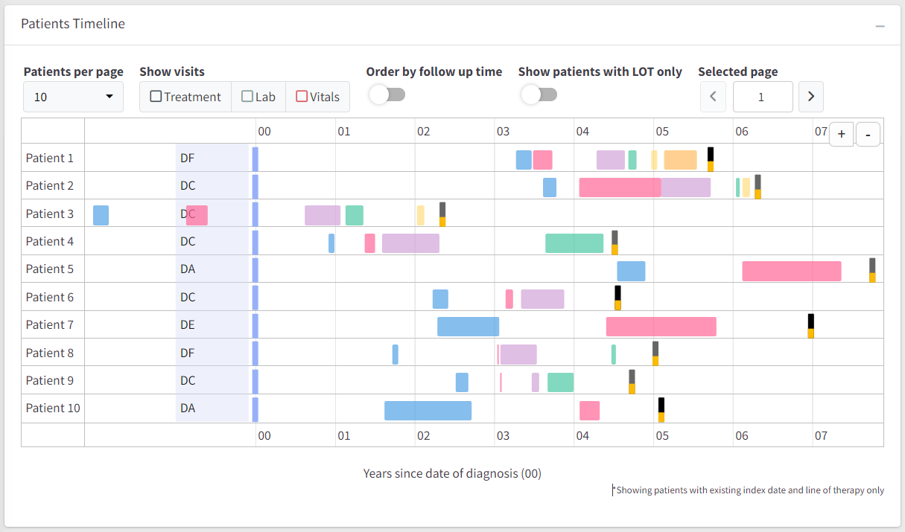

# **shinyTimelines** 
Predefined component for shiny dashboards.

## About
Package contains code of timelines component, both UI and Server function. 
The package allows injecting the timelines component into the app, 
what speeds up building reproducible part of the dashboards.



## Installation

From Github
```R
remotes::install_gitlab(
  "r-world-devs/shinyTimelines"
)
```

## Usage

Please check [examples](./examples).
